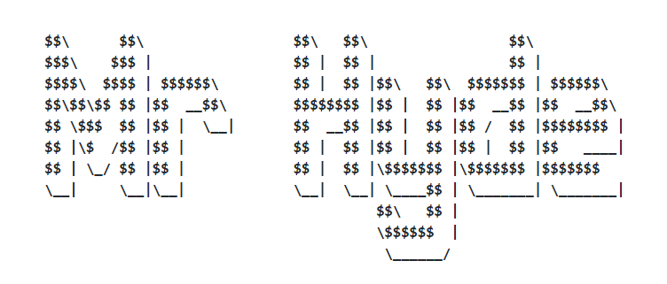

<p align="center">
   
</p>
<hr/>

<p align="center">
   
   
   
   
</p>
 
<p align="center">
   <a href="https://nodei.co/npm/mister_hyde/">
      
   </a>
</p>

To scan a folder `./example` ↴

```
$ mrHyde scan ./example
```

To generate from a folder `./example` to `./out` ↴
```
$ mrHyde run ./example ./out
```

To generate from a folder `./example` to `./out` in __watch__ mode ↴
```
$ mrHyde run ./example ./out -w
```

To start in dev mode, from a folder `./example` to `./out`, and exposing the generated content to `http://localhost:8080` ↴
```
$ mrHyde dev ./example ./out -p 8080
```

And for more, see [usage](#usage) 🚀

## What's that?
**MrHyde** is a very simple and lightweight **static website generator**. MrHyde allow
to build simple (or complex, that's up to you) static websites, using HTML templates and
markdown. As for others generator, minimal componants to create a blog are also included.

MyHyde is powered by [LiquidJs](https://liquidjs.com/) & [Marked](https://marked.js.org/) 🧙‍♂️

### What's a static website and why should I care
A static website is _serverless_ website, i.e. meaning that you don't need to write and run
your own web server. You'll still need _some_ server to serve your static files, but
that's a much easier problem to have as there's free services (like Github Pages) that'll do that
for you, free of charges.

### Isn't it just like Jekyll?
Yes, hence the name. This is a pet project, made to be lightweight and have just the minimum of features 
required to be effectively used. Jekyll in comparison is (a lot) more mature, and have a plethora of features
that MrHyde won't ever have.

## Usage
### Getting started
Installation ↴
```
$ npm install -g mrHyde
```

Usage from `./example` to `./out` ↴
```
$ mrHyde run ./example ./out
```

You may also start in watch mode to automatically re-run the generation when any file is modified ↴
```
$ mrHyde run ./example ./out --watch
```

Only scanning the directory is also possible ↴
```
$ mrHyde scan ./example
```

Finally, if you're actively working you might want to start the application in dev mode,
which active the watcher and expose the `out` directory to HTTP ↴
```
$ mrHyde dev ./example ./out -p 8080
```

### Project structure
A project should follow this organisation:
<pre>
/
    index.html            // Index page, plain HTML
    about.liquid          // Page using a liquid template
    /_sutff               // Ignored directory (or file) starting with a _
        ignored.html
    /somePage             // Page
        _template.liquid  // Template used for all the pages in that sub folder
        firstPage.md      // Markdown page, needs a template to be rendered
        secondPage.md       
    /someOtherPage        // Page
        _template.liquid  // Template used for all the pages in that sub folder
        firstPage.yml     // Yaml data page, needs a template to be rendered
        secondPage.yml       
    assets/               // Asset folder, will be moved without any processing
        image.png 
</pre>

The generated files will keep their original path and name once processed into the output directory.

### Special directories & files
Any file or directory starting with an underscore will be ignored during the processing. Ignored files
may but indirectly used, as the `_template.liquid` file.

The `_template.liquid` file is a special file that will be used along with all the other pages present
its own folder. This file is required for **markdown** and **yaml** files, as they don't have an easy
way to produce complete HTML on their own.

The asset directory should be used to store assets that won't be processed by **MrHyde** and referenced
by the differents pages

### Metadata
Any file can contain metadata. This metadata is defined in yaml at the first of the file, and will be passed
either to the template (if a template is used), or to the parent directory.

**MrHyde** will also had some convenient metadata, such as the date of generation, name of the file,
and full relative path.

For example, in a `.md` file:
```markdown
---
title: My first great blog article
author: Vuzi
abstract: This is my first article !
tags:
  - Blogging
  - Hacker
  - Test
---
# Introduction
Hello
```
Will result in the local template file to be called with the following metadata:

```javascript
{
  "filePath": "foo/bar/stuff.md",
  "fileName": "stuff.md",
  "now": "2021-05-23T10:26:00.996Z",
  "title": "My first great blog article",
  "author": "Vuzi",
  "abstract": "This is my first article !",
  "tags": [ "Blogging", "Hacker", "Test" ],
  "content": // HTML from the markdown
}
```

### Templating
**Markdown** and **yaml** require a template to be rendered. Liquid files can also be used along a template.
A template is a special file name `_template.liquid` that will be applied to the directory it is defined in.

The template can be used along the metadata defined previously :

```liquid
<article>

  <header>
    <h1>{{ metadata.title }}</h1>

    <span>
      By {{ metadata.author }}
    </span>

  </header>

  {{ content }}

</article>
```
### Passing metadata upward
Metadata will bubble up from every file generated, allowing to create links and use that information dynamically:
<pre>
/
    index.liquid
    /posts
        post1.liquid
</pre>

`posts/post.liquid` ↴
```
---
title: My first great blog article
abstract: This is an article
---
[... content]
```

`index.liquid` ↴
```liquid
  <div>
    <ul>
    
      
      <li>
        <h2>{{ post.title }}</h2>
        <p>{{ post.abstract }}</p>
        <a href="{{ post.filePath }}" >Click here</a>
      </li>
    
    </ul>
  <div>
```

## Command line arguments
```
$ mrHyde scan -h

Scan the source folder

Positionals:
  dir  Directory to scan                               [required] [default: "."]

Options:
  -v, --version    Show version number                                 [boolean]
  -h, --help       Show help                                           [boolean]
      --templtate  Template file          [string] [default: "_template.liquid"]
```

```
$ mrHyde run -h

Run the static website generator

Positionals:
  dir  Directory to scan                                     [string] [required]
  out  Output directory                              [string] [default: "./out"]

Options:
  -v, --verbose   Run with verbose logging            [boolean] [default: false]
      --version   Show version number                                  [boolean]
  -h, --help      Show help                                            [boolean]
      --template  Template file           [string] [default: "_template.liquid"]
      --asset     Asset directory                   [string] [default: "assets"]
  -e, --erase     Erase the output before generation  [boolean] [default: false]
  -w, --watch     Run in watch mode                   [boolean] [default: false]
  
```

```
$ mrHyde dev -h

Run the static website generator in watch mode and expose the result

Positionals:
  dir  Directory to scan                                     [string] [required]
  out  Output directory                              [string] [default: "./out"]

Options:
  -v, --verbose   Run with verbose logging            [boolean] [default: false]
      --version   Show version number                                  [boolean]
  -h, --help      Show help                                            [boolean]
      --template  Template file           [string] [default: "_template.liquid"]
      --asset     Asset directory                   [string] [default: "assets"]
  -e, --erase     Erase the output before generation  [boolean] [default: false]
      --host      Web server host                [string] [default: "localhost"]
  -p, --port      Web server port                         [number] [default: 80]
```
